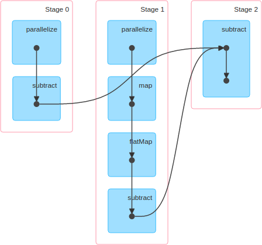
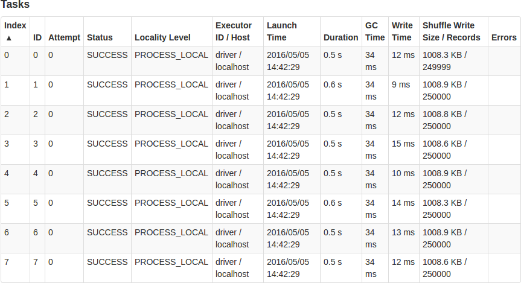
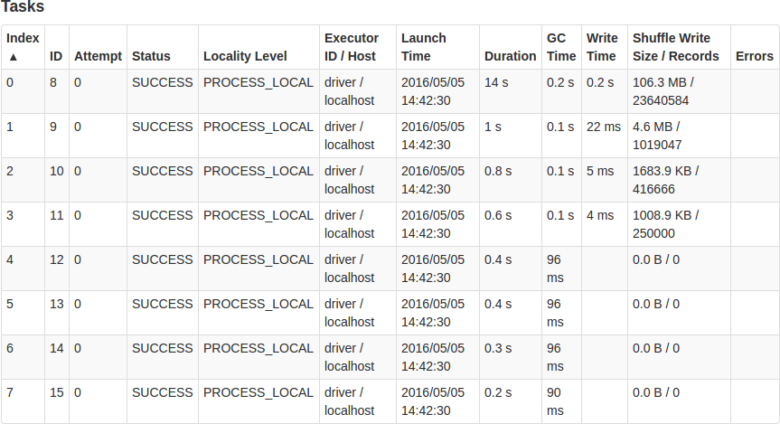
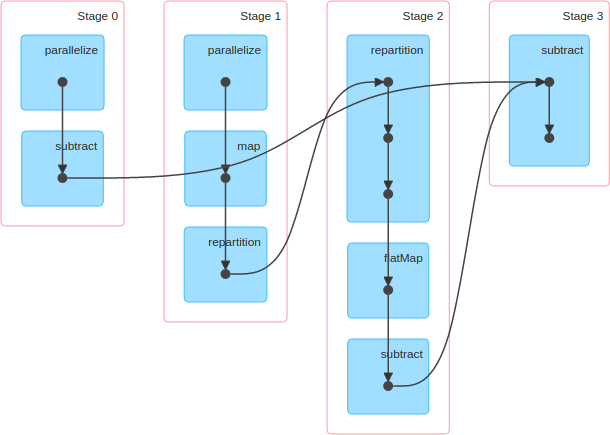
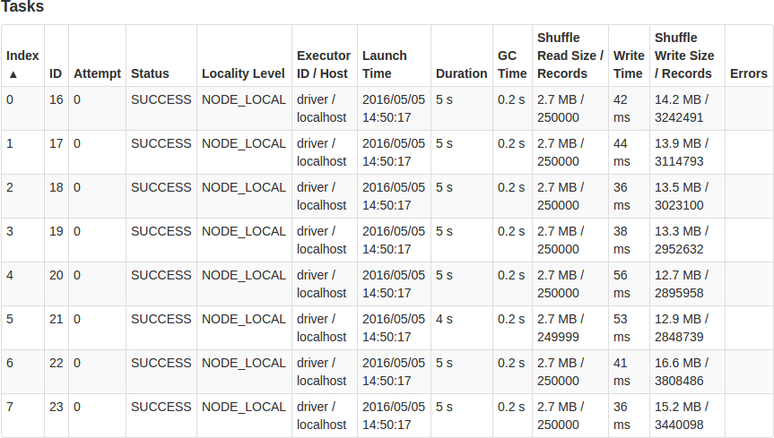

# Improving Spark Performance With Partitioning

At Sortable we use [Spark](http://spark.apache.org/) for many of our data processing tasks. Spark is an engine that allows us to run many tasks in parallel across dozens of machines in a cluster, but it can also be used to run tasks across cores on a desktop.

One of the tricks that we've found to improve performance of Spark jobs is to repartition our data. We'll illistrate how this can help with a simple example.

## Finding Prime Numbers

Let's say we want to find all the prime numbers up to 2 million. We'll do this very naively by first finding all composite (non-prime) numbers, then find all numbers that are not composite to get the prime numbers.

We'll find all composite numbers by taking every natural number from 2 to 2 million, then find all multiples of these numbers that are smaller than or equal to 2 million. We will have many duplicates (6 will show up in our multiples of both 2 and 3, for example), but that's ok.

Let's do this in the Spark shell:

    Welcome to
          ____              __
         / __/__  ___ _____/ /__
        _\ \/ _ \/ _ `/ __/  '_/
       /___/ .__/\_,_/_/ /_/\_\   version 1.6.1
          /_/
    
    Using Scala version 2.10.5 (OpenJDK 64-Bit Server VM, Java 1.7.0_101)
    Type in expressions to have them evaluated.
    Type :help for more information.
    Spark context available as sc.
    SQL context available as sqlContext.
    
    scala> val n = 2000000
    n: Int = 2000000
    
    scala> val composite = sc.parallelize(2 to n, 8).map(x => (x, (2 to (n / x)))).flatMap(kv => kv._2.map(_ * kv._1))
    composite: org.apache.spark.rdd.RDD[Int] = MapPartitionsRDD[2] at flatMap at <console>:29
    
    scala> val prime = sc.parallelize(2 to n, 8).subtract(composite)
    prime: org.apache.spark.rdd.RDD[Int] = MapPartitionsRDD[7] at subtract at <console>:31
    
    scala> prime.collect()
    res0: Array[Int] = Array(563249, 17, 281609, 840761, 1126513, 1958993, 840713, 1959017, 41, 281641, 1681513, 1126441, 73, 1126457, 89, 840817, 97, 1408009, 113, 137, 1408241, 563377, 1126649, 281737, 281777, 840841, 1408217, 1681649, 281761, 1408201, 1959161, 1408177, 840929, 563449, 1126561, 193, 1126577, 1126537, 1959073, 563417, 233, 281849, 1126553, 563401, 281833, 241, 563489, 281, 281857, 257, 1959241, 313, 841081, 337, 1408289, 563561, 281921, 353, 1681721, 409, 281993, 401, 1126897, 282001, 1126889, 1959361, 1681873, 563593, 433, 841097, 1959401, 1408417, 1959313, 1681817, 457, 841193, 449, 563657, 282089, 282097, 1408409, 1408601, 1959521, 1682017, 841241, 1408577, 569, 1408633, 521, 841273, 1127033, 841289, 617, 1408529, 1959457, 563777, 841297, 1959473, 577, 593, 563809, 601,...

The answer looks reasonable, but let's look at the performance. If we go into the Spark UI we can see that Spark used 3 stages. Here's the DAG (Directed Acyclic Graph) visualization from the UI, which shows the various pieces that were computed along the way:

Let's briefly look at Stage 0's tasks:

Our `sc.parallelize(2 to n, 8)` created 1999999 records, which were evenly distributed across the 8 partitions. Each task took about the same amount of time, so this looks good.

Stage 1 is the most interesting stage, since it ran our `map` and `flatMap`. Let's look at it too:

This doesn't look very good, because the work load was not well balanced across the tasks. Over 93% of the data ended up in a single partition, who's task took 14 seconds to run. The next slowest task took 1 second. Since we had 8 cores decicated to this job, this means that we had 7 idle cores for 13 seconds while they waited for the stage to complete. This is a very inefficient use of resources.

## Why did this happen?

When we ran `sc.parallelize(2 to n, 8)`, Spark used a partitioning scheme that nicely divided the data into 8 even groups. Most likely it used a range partitioner, where the numbers from 2-250000 were in the first partition, 250001-500000 in the second, etc. However, our map turned this into (key,value) pairs where the values had wildy different sizes. Each value was a list of all integers we needed to multiply the key by to find the multiples up to 2 million. For half of them (all keys greater than 1 million) this meant that the value was an empty list. Our largest value was for key 2, which had all integers from 2 to 1000000. This is why the first partition had most of the data, while the last four had none.

## How do we fix this?

We can repartition our data. Calling `.repartition(numPartitions)` on an RDD in Spark will shuffle the data into the number of partitions we specify. Let's try adding that to our code.

We'll run the same thing as before, but insert `.repartition(8)` between the `.map` and the `.flatMap`. Our data will have the same number of partitions, but the data will be redistributed across those partitions. Then our second line looks like this:

    val composite = sc.parallelize(2 to n, 8).map(x => (x, (2 to (n / x)))).repartition(8).flatMap(kv => kv._2.map(_ * kv._1))

Our new DAG is a little more complicated:

Stage 0 is the same as before. Our new Stage 1 looks very similar to Stage 0, with each task having about 250000 records and taking about 1 second. The interesting one is Stage 2:

This looks much better than our old Stage 1. We still process the same number of records, but this time the work is more evenly distributed across the 8 partitions. Each task took about 5 seconds and our cores were used more efficiently.

In both versions of our code the final stage took about 6 seconds. So the total time for our first version was about 0.5 + 14 + 6 = ~21 seconds, but our second one took 0.5 + 1 + 5 + 6 = ~13 seconds. The second version had to do some extra work to repartition the data, but that reduced the overall time because it allowed us to use our resources more efficiently.

Of course if the goal is to find prime numbers then there are much more efficient algorithms out there. But this example demonstrates the importance of considering how your Spark data is distributed. Introducing a `.repartition` will increase the amount of work that the Spark engine has to do, but the benefit can significantly outweigh that cost. If you're really clever you could even partition your initial data source in a better way.
